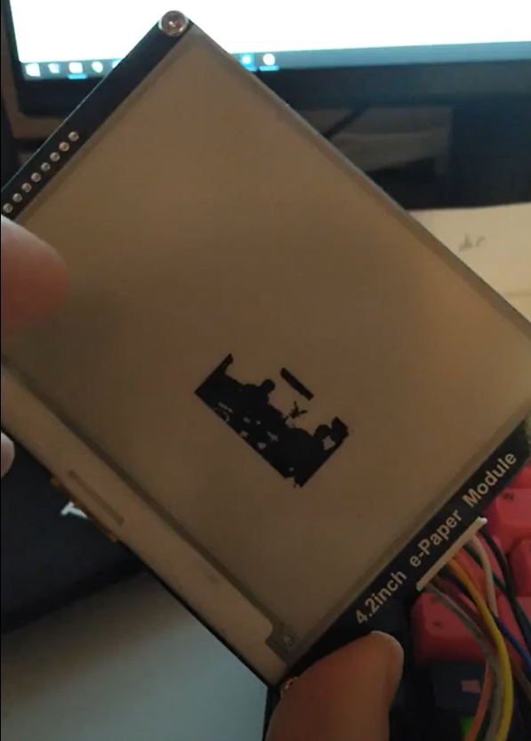
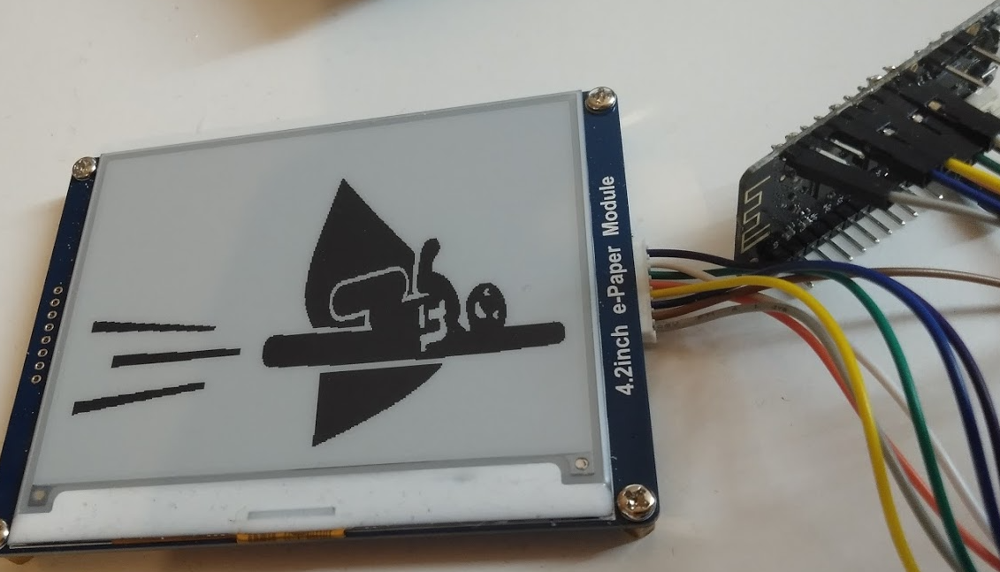
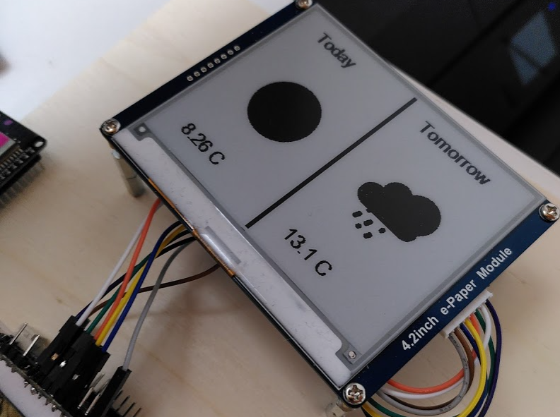

# EPaper Display

The goal of this side project is to use an EPaper display to display custom messages or the weather. [TL;DR](#tldr)

## 1 Interacting with the Display

First I had to understand how to send Images to the ePaper display. The device is described [here](https://www.waveshare.com/wiki/4.2inch_e-Paper_Module), however this was way to technical for me, so I kept looking.  Quite quickly i found the library [GxEPD](https://github.com/ZinggJM/GxEPD) with some handy [examples](https://github.com/ZinggJM/GxEPD/blob/master/examples/GxEPD_MultiDisplayExample/GxEPD_MultiDisplayExample.ino). 

I downloaded the example configured it and was able to display the example images. Great!

## 2 Sending Image Data

Since we want to be able to display images without manually interacting with the ESP32 we need to somehow send the data to the device.

To send and receive the image data to the ESP32 I will use [MQTT](https://mqtt.org/), because it is lightweight, perfect for an IoT devices but mostly because I know how to use it.

The data receiving function looks as follows:
```c++
void callback(char *topic, byte *message, unsigned int length)
{
  Serial.println("Received message with length:");
  Serial.println(length);
  if (length == 0)
  {
    clearScreen();
    return;
  }  
  // a function from the GxEPD library
  display.drawBitmap(message, length);
}
```

To send any data I built a backend that converts an image by a given URL to a Bitmap image and extracts the byte data. This byte data is then published via MQTT. Also a frontend was built to test everything. I was able to send data and verify it was received on the ESP32, however only garbage was displayed. It became clear, that I cannot display bitmap Images out of the box.

After a lot of research, writing and copying painful c++ code, I was able to display a Bitmap by reading the header and the image data manually: 
```c++
  uint32_t fileSize = read32(bytes);
  uint32_t creatorBytes = read32(bytes);
  uint32_t imageOffset = read32(bytes); // Start of image data
  uint32_t headerSize = read32(bytes);
  uint32_t width = read32(bytes);
  uint32_t height = read32(bytes);
  uint16_t planes = read16(bytes);
  uint16_t depth = read16(bytes); // bits per pixel
  uint32_t format = read32(bytes);
  uint32_t bytes_read = 7 * 4 + 3 * 2; // read so far
  Serial.print("File size: ");
  Serial.println(fileSize);
  Serial.print("Image Offset: ");
  Serial.println(imageOffset);
  Serial.print("Header size: ");
  Serial.println(headerSize);
  Serial.print("Bit Depth: ");
  Serial.println(depth);
  Serial.print("Image size: ");
  Serial.print(width);
  Serial.print('x');
  Serial.println(height);
  Serial.print("format");
  Serial.println(format);
  Serial.print("planes");
  Serial.println(planes);
```

This actually worked, but i was only able to display tiny images, due to image file size. 



After a few days of struggling with the bitmap format and not making any real progress due to compression, file depth, and c# image libraries, I tried a new approach.

## 3 Converting the Image Data

The best way to send the data, would be to do all the calculations needed on the server and simply send the necessary pixel array to the ESP32. This is somewhat complicated, luckily i found the Website [image2cpp](https://javl.github.io/image2cpp/) which already does this. 

The site is opensource, so I was able to use the implemented logic and just had to rewrite it to c#.



This then enabled me to send full sized (400px * 300px) to the ESP32 and display them! Hurray!

## 4 Displaying the Weather

Now I knew how to display any picture I wanted and decided to try and display todays and tomorrows weather. To get the weather data i used [openweathermap.org](https://openweathermap.org/api/one-call-api) which is a simple and free weather api. 

Then I implemented all the classes and a service calling the API in the backend. All that was left, was to build an image from the given weather report. 
This was much simpler than feared, openweather even offers the icons and all I needed was some sort of base image with the right size, and place all other images onto this display: 



## 5 Updating the weather continuously

To update the weather continuously, a GET method was created which, when called, gets the newest weather and updates the display with the created image. 
This API was then deployed onto a raspberry pi and a timed job, which calls the API every 4 hours was added using [cron](https://www.digitalocean.com/community/tutorials/how-to-use-cron-to-automate-tasks-ubuntu-1804).

## 6 Next Steps

I will try to build a nice case for the display, so it can actually be hung up. Furthermore I will try to display additional information, like appointments, messages etc. For such functions, maybe buttons will be added to the constructions.


## TL;DR

EPaper display receives Image from todays and tomorrows weather report every 4 hours and displays the given image. The Image gets broken down to Pixel Data by .net core backend so it can be easily sent via MQTT and the ESP32 does not have to calculate anything. Everything is scheduled using cron.

## Components

The components used were the following:

- [EPaper display](https://www.bastelgarage.ch/400x300-4-2inch-e-ink-display?search=400x300%204.2inch%20E-Ink%20Display)
- [ESP32](https://www.bastelgarage.ch/wemos-lolin32-lite-board-esp32-rev1-4-mb-flash?search=esp32)
- Cables

## Code

The code was written in .net core, c++ and angular, however the angular frontend was only used to test the backend and will not be deployed anywhere.

All the code is available in my [repository](https://gf3r.visualstudio.com/EPaper/_git/EPaper.Web)

